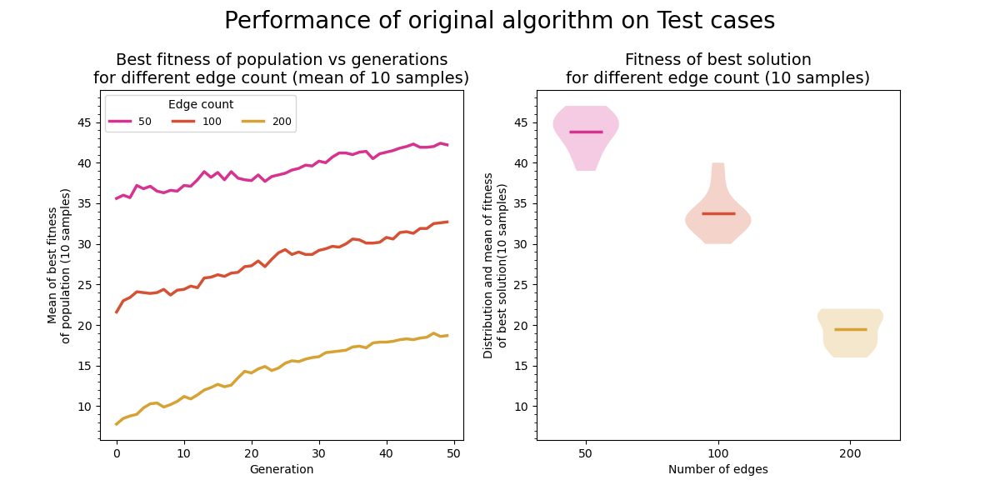

<table width="100%" border="0">
<tr>
<th colspan="3" align="center">CS F407 Artificial Intelligence -- Assignment 1</th>
</tr>
<tr>
<td>Aryan Tyagi</td>
<td>2019A7PS0136G</td>
<td>1 Oct 2022</td>
</tr>
<tr>
<td colspan="3" align="left">
<ul>
<li>Python 3.10.6</li>    
</ul>
</td>
</tr>
</table>

## Question 1: Vertex Coloring Problem

### A.

#### Observations:

- For each edge count, we create 10 random graphs. On each random graph, we start with a random population of size 100. We keep a track of the best fitness value in each generation. Taking the average of 10 graphs, we get the plot on the left. Notice how the function grows slowly and is not monotonic.
- If we plot a fboxplot chart for any random graph, we get a plot similar to the one on the bottom. We note that most of the population is centered around the median and only a few very 'fit' individuals exist. It also doesnot grow continuously, although the overall trend is increasing.
- The final value of the best fitness function will be the fitness of the best individual. We can average all such values and plot them against the number of edges. If we use a violin plot, we can also see the distribution of the fitness value of the best individual. We notice that the y-axis of this plot is aligned with the first plot as this is just the cross sectional view of the first plot.

### B.

#### Modifications to the algorithm:

- Fitness function was _not_ modified, so that we can compare the results. Instead, function `get_weights` was modified. This function is used to assign weights to the population. Using these weights, two parents are choosen to create a new child. Originally this was linealy dependent on the fitness of the individual. However, I chose to make it proportional to the square of fitness. This enhances the chances of a fit individual to be selected for reproduction, since squaring diminishes small values more compared to larger values. NOTE: I had to first scale the fitness to [0, 1] range.
- I added a `mutate_invalid` function. Invalid vertex are those vertices which have the same color and are connected by an edge. We should not mutate 'valid' vertices, since they are contributing to the fitness. On the other hand, mutating invalid vertices may increase the fightness. This function randomly assigns new values to all invalid vertex.
- Using two different forms of mutation -- original and `mutate_invalid`. Sometimes we can reach a dead end while assigning colors (when solving manually), in which case we need to backtrack and change one of the 'valid' vertex. Taking this into account, each pair of parent produces two children, accounting for both kinds of mutation
- Carryover the best of current population. If we replace the current population with completely new population, we might not alyas move towards fitter solution (as evident from the graph on the bottom). Therefore we can also add the current population to newly created children and take the best of this combined population for next generation. I found that making a hybrid population consisting of top 50% original population + their mutation + 2 types of children = 200% original population -> choose top half, gives decent results.
- Dynamic mutation rate: I changed the mutation probability to be inversely proportanal to the square of fitness. This gives us a nice exploratory behavior initially, but then slows down mutation as the fitness reaches higher values 
- We can also increase the population size, however I didnot consider this for the final algorithm since it was increasing the time required for finding the solution.
- I first plotted the change in best fitness value over many generations, and found that after `#edges / 2` generations, the increase in fitness is negligible

#### Observations:

- Each population starts as a centered distribution, but because of our selectivity of fitter individuals, the population becomes skewed towards the top as generations increase.
- The best fitness of the population never decreases, since newer population has to compete with existing population before it is allowed into the next generation.
- Except for the case of 500 edges, the best fitness curve flattens around `#edges/2` generations.
- The dashed line in the plot on the right represents the mean values from the original algorithm. We can see a significant improvement after modifications.

### Screenshot

### Test Cases

We use the exact same plots as before, however we have a fixed graph now. We generate 10 random initial populations and track the best fitness in each generation

#### Original Algorithm

#### Modified Algorithm

